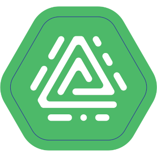

# ioBroker.acme

[](https://www.npmjs.com/package/iobroker.acme)
[](https://www.npmjs.com/package/iobroker.acme)


[](https://nodei.co/npm/iobroker.acme/)

**Tests:** 

## ACME adapter for ioBroker

This adapter generates certificates using ACME challenges.

## Usage

The adapter starts periodically (default at midnight) and after configuration updates to generate any required certificates (new or soon to expire).

### Scope

This adapter currently targets the following scope:

- Certificate Authority: **Let's Encrypt only**
- ACME environment selection: **Staging** and **Production**
- Key handling: automatic (no manual key type selection required)

This scope is intentional to keep the adapter setup simple and robust.

Currently, orders are processed with the Let's Encrypt certificate authority and thus are free of charge.

The adapter attempts renewal starting **7 days before certificate expiry**.

Certificate details are stored in a 'certificate collection' object which includes other relevant details such as expiry date, domains to be secured and private key.
These objects are referenced by their collection ID.

Adapters which need certificates to secure their communications (e.g. [web adapter](https://www.npmjs.com/package/iobroker.web)) are able to load and utilise certificate collections.

Storage and use are handled by an interface contained with the [core ioBroker controller](https://www.npmjs.com/package/iobroker.js-controller).

### Quick setup checklist

1. Set a valid maintainer email.
2. Choose **Staging** first to validate challenge configuration.
3. Configure either HTTP-01 or DNS-01 (or both).
4. Configure at least one certificate collection.
5. Switch to **Production** only after successful staging runs.

### ACME Challenges

Two methods of challenge verification are implemented, and at least one should be enabled on the configuration page.

Note that wildcard certificate orders can only be validated using the DNS-01 challenge.

#### HTTP-01

The adapter starts its own HTTP-01 challenge server on the configured port and address.

For an HTTP-01 challenge to be successful, the challenge server's port/address **must** be publicly reachable as port 80 of the FQDN given in a collection common/alt name from the open internet.

Configure your firewall, reverse proxy, etc. accordingly.

Example scenarios:

1. The IoB host on which ACME is running is behind a router, and that router has a publicly reachable IP address:

    Solution:

    - Configure ACME to run on any free port: E.g.: 8092.
    - Configure the router to forward connections to port 80 of its public address to port 8092 of the IoB host.
    - Configure the DNS name of the desired certificate common name to resolve to the public address of the router.

2. The IoB host on which ACME is running has a direct internet connection with a publicly reachable IP address:

    Solution:

    - Configure ACME adapter to listen on port 80.
    - Configure the DNS name of the desired certificate common name to resolve to the public address of the IoB host.

3. Scenario 1 & 2 are impossible because another service is running on port 80 of the publicly reachable IP address.

    Possible solutions:

    1. If the other service is an IoB adapter following port configuration naming standards, ACME will stop it before attempting to order a certificate, use port 80 for the HTTP-01 challenge server, and restart any stopped adapter when done.

        Obviously, this causes a short outage for the other adapter which may not be desirable.

    2. Use a DNS-01 challenge.
    3. Set up a named virtual host HTTP proxy on port 80 of the router or publicly reachable IoB host.

        - Give the existing service a different hostname to the one a certificate is required for and configure that hostname to resolve to the same address.
        - Configure the proxy to forward requests to either the existing service or ACME adapter based on the name used.

    4. Run ACME manually only when required port access is available. **Not recommended**, but should work:

        - Disable (stop) the ACME adapter after installation.
        - Shortly before certificate order or renewal is required (renewal will occur up to 7 days before expiry) manually perform the following steps:
            - Set up any firewall/port forwarding/other maintenance required to allow ACME to run on the configured port and for that port to be accessible from the public internet.
            - Start ACME manually from the IoB Admin Instances page.
            - Wait for ACME to complete any certificate orders.
            - Stop ACME manually from the IoB Admin Instances page.
        - These steps will be required every time a certificate order/renewal is required, and as such this method is **not recommended**. ACME is designed to facilitate a fully automated process.

#### DNS-01

Various DNS-01 challenge plugins are implemented for popular domain hosting platforms.

Available module choices in the adapter UI:

- Cloudflare
- DigitalOcean
- DNSimple
- deSEC
- DuckDNS
- Gandi
- GoDaddy
- Namecheap
- Name.com
- Netcup
- Vultr
- acme-dns (CNAME delegation)

##### DNS-01 provider smoke check (current dependencies)

Smoke test date: 2026-04-03

Test scope:

- Module can be loaded
- `create()` works with adapter-like config
- `init({ request })` works where available
- `set/remove` were called with dummy credentials and synthetic challenge data

Interpretation:

- `Auth/API error` is expected with dummy credentials and means the provider path is functionally reached.
- This is not a live end-to-end verification against real DNS zones.
- This matrix covers only directly integrated `acme-dns-01-*` npm packages.

| Provider package | Load + create | init | set/remove with dummy credentials | Result |
| --- | --- | --- | --- | --- |
| acme-dns-01-cloudflare | OK | OK | Bad Request | Reachable (auth/API path active) |
| acme-dns-01-digitalocean | OK | OK | Error response (token/baseUrl/domains) | Reachable (auth/API path active) |
| acme-dns-01-dnsimple | OK | OK | Error response (token/baseUrl/domains) | Reachable (auth/API path active) |
| acme-dns-01-desec | OK | OK | Error response (token/baseUrl/domains) | Reachable (auth/API path active) |
| acme-dns-01-duckdns | OK | OK | Record not set/removed | Reachable (provider-level validation hit) |
| acme-dns-01-gandi | OK | OK | set: response parse error, remove: OK | Partially reachable; keep under observation |
| acme-dns-01-godaddy | OK | OK | UNABLE_TO_AUTHENTICATE | Reachable (auth/API path active) |
| acme-dns-01-namecheap | OK | OK | API Error | Reachable (auth/API path active) |
| acme-dns-01-namedotcom | OK | OK | Permission Denied | Reachable (auth/API path active) |
| acme-dns-01-netcup | OK | OK | Netcup API rate-limit error (4013) | Reachable (API path active) |
| acme-dns-01-vultr | OK | n/a | Record not set/removed | Reachable (provider-level validation hit) |

For real production validation, test with valid credentials and a disposable domain/zone per provider.

##### Alias vs acme-dns

`DNS-01 Alias` and `acme-dns` are related, but not the same:

- **DNS-01 Alias** (adapter setting):
    - Changes where challenge records are written.
    - The adapter writes TXT records under `_acme-challenge.<alias-domain>` instead of `_acme-challenge.<requested-domain>`.
    - Useful if your authoritative domain is different from your challenge zone.
- **acme-dns** (challenge backend):
    - Is a dedicated DNS challenge API service.
    - The adapter updates TXT values via acme-dns API (`/update`) using scoped credentials.
    - Typically combined with CNAME delegation from your public zone to acme-dns managed records.

In short:

- Alias controls the target name.
- acme-dns controls how TXT records are updated.

##### Optional live provider tests (with real credentials)

The repository now includes an optional test entrypoint for real provider credentials:

- Script: `npm run test:providers:live`
- Test file: `test/provider.live.js`
- Activation: set environment variable `ACME_DNS_LIVE_CONFIG`

`ACME_DNS_LIVE_CONFIG` points to a JSON file keyed by provider package name.

Example:

```json
{
    "acme-dns-01-cloudflare": {
        "config": {
            "token": "<cloudflare-api-token>"
        },
        "challenge": {
            "dnsZone": "example.com",
            "dnsPrefix": "_acme-challenge.live-test",
            "dnsAuthorization": "test-value"
        }
    },
    "acme-dns-01-godaddy": {
        "config": {
            "key": "<godaddy-key>",
            "secret": "<godaddy-secret>"
        },
        "challenge": {
            "dnsZone": "example.com",
            "dnsPrefix": "_acme-challenge.live-test",
            "dnsAuthorization": "test-value"
        }
    }
}
```

Run example:

```bash
ACME_DNS_LIVE_CONFIG=./test/live-provider-config.example.json npm run test:providers:live
```

Recommendation:

- Use a disposable zone/subdomain and low-privilege API credentials.
- Keep this test optional and out of mandatory CI jobs.

##### acme-dns How-to (integrated in adapter)

The adapter supports `acme-dns` directly via the DNS-01 module selection.

Configure in Admin:

1. Enable `Use DNS-01 challenges`.
2. Select `acme-dns (CNAME delegation)` as DNS-01 module.
3. Fill credentials:
    - `DNS-01 Username` -> acme-dns `X-Api-User`
    - `DNS-01 Secret` -> acme-dns `X-Api-Key`
    - `DNS-01 Token` -> acme-dns `subdomain`
4. Optional: set `DNS-01 Base URL` for self-hosted acme-dns instances.
    - If empty, default endpoint `https://auth.acme-dns.io` is used.
5. Configure CNAME delegation in your authoritative DNS:
    - `_acme-challenge.<your-domain>` CNAME to your acme-dns target hostname.

Result:

- Certificate orders/renewals stay fully inside this adapter workflow via Admin configuration.

##### DNS-01 Alias (CNAME)

If your certificate domains are hosted in a different DNS setup than your ACME TXT records, you can use **DNS-01 Alias**.

When set, the adapter writes DNS-01 TXT challenges below:

- `_acme-challenge.<dns01Alias>`

instead of:

- `_acme-challenge.<requested-domain>`

This is useful for delegated challenge zones via CNAME.

Example:

- Requested domain: `sub.example.com`
- ACME TXT alias zone: `acme.example.net`
- CNAME at source zone: `_acme-challenge.sub.example.com CNAME _acme-challenge.acme.example.net`

Input format for **DNS-01 Alias** in adapter settings:

- Enter only the domain part, for example `acme.example.net`
- Do **not** include `_acme-challenge.` (it is added automatically)

##### Additional DNS providers

If your DNS provider is not directly supported by this adapter, you still have strong options.

##### Free alternatives to DuckDNS

Yes, there are free alternatives that can be more capable than DuckDNS, especially for multi-domain/wildcard scenarios.

1. **deSEC (`acme-dns-01-desec`) — recommended free alternative**
    - Free (donation-based) DNS provider with API support.
    - Supports multiple TXT records reliably, which helps for parallel ACME challenges.
    - Good fit if you want a direct provider integration in this adapter.

2. **acme-dns (`acme-dns-01-acmedns`) — generic challenge backend**
    - Specialized service for ACME DNS challenges.
    - Works well with CNAME delegation and keeps scoped challenge credentials separate from your primary DNS account.
    - Integrated in this adapter via Admin configuration.

3. **Cloudflare (`acme-dns-01-cloudflare`) — free plan, very robust DNS API**
    - Free DNS plan with mature API and high reliability.
    - Requires that your domain DNS is managed by Cloudflare.

##### Practical recommendation

If you need a free replacement for DuckDNS and want direct adapter integration, start with **deSEC**.

If your existing DNS hoster has no suitable API integration, use **acme-dns + CNAME delegation**.

If you can move DNS hosting, **Cloudflare** is usually the most robust long-term option.

#### References

See [acme-client](https://www.npmjs.com/package/acme-client) for implementation details of ACME account/order handling.

<!--
    Placeholder for the next version (at the beginning of the line):
    ### **WORK IN PROGRESS**
-->

## Changelog
### 3.0.2 (2026-03-10)
- (@GermanBluefox) Correcting configuration dialog
- (@GermanBluefox) Added tests for GUI component

### 3.0.0 (2026-03-05)
- (lubepi) BREAKING: DNS-01 credentials are encrypted now. You might have to reenter them once after upgrading the adapter.
- (copilot) Adapter requires admin >= 7.7.22 now
- (lubepi) Added support for Netcup DNS-01 challenge 
- (@GermanBluefox) Optimisations on log output and error handling

### 2.0.0 (2026-02-12)
- (mcm1957) Adapter requires node.js >= 20, js-controller >= 6.0.11 and admin >= 7.6.17 now
- (mcm1957) Dependencies have been updated
- (@GermanBluefox) Adapter was migrated to TypeScript and vite

### 1.0.6 (2024-12-27)

- (mcm1957) Missing size attributes for jsonConfig have been added.
- (mcm1957) Dependencies have been updated

### 1.0.5 (2024-12-08)

- (@GermanBluefox) Corrected error with admin 7.4.3

## License

MIT License


Copyright (c) 2023-2026 iobroker-community-adapters <iobroker-community-adapters@gmx.de>  
Copyright (c) 2023 Robin Rainton <robin@rainton.com>

Permission is hereby granted, free of charge, to any person obtaining a copy
of this software and associated documentation files (the "Software"), to deal
in the Software without restriction, including without limitation the rights
to use, copy, modify, merge, publish, distribute, sublicense, and/or sell
copies of the Software, and to permit persons to whom the Software is
furnished to do so, subject to the following conditions:

The above copyright notice and this permission notice shall be included in all
copies or substantial portions of the Software.

THE SOFTWARE IS PROVIDED "AS IS", WITHOUT WARRANTY OF ANY KIND, EXPRESS OR
IMPLIED, INCLUDING BUT NOT LIMITED TO THE WARRANTIES OF MERCHANTABILITY,
FITNESS FOR A PARTICULAR PURPOSE AND NONINFRINGEMENT. IN NO EVENT SHALL THE
AUTHORS OR COPYRIGHT HOLDERS BE LIABLE FOR ANY CLAIM, DAMAGES OR OTHER
LIABILITY, WHETHER IN AN ACTION OF CONTRACT, TORT OR OTHERWISE, ARISING FROM,
OUT OF OR IN CONNECTION WITH THE SOFTWARE OR THE USE OR OTHER DEALINGS IN THE
SOFTWARE.
